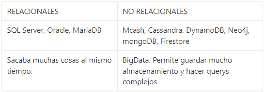

# BASES DE DATOS

[Version en notion](https://www.notion.so/BASES-DE-DATOS-b51945d633a94deda8841a96436137c7) 
- GENERALIDADES
    
    
    
    Servicios autoadministrados: base de datos que tu instalas en tu computadora o en tu servidor. Tu te encargas de las actualizaciones, mantenimiento, consistencia de datos, etc.
    
    Servicios administrados: son servicios que ofrecen las nubes modernas como amazon, google, miscrosoft; que ofrecen el servicio de la base de datos: vas a usarla pero no tienes que instalarla ni ocuparte de todo el mantenimiento.
    
    Entidad: representa algo en el mundo real. Se encierran en rectángulos. Por convención las entidades se ponen en plural, porque representan un grupo de estos objetos.
    
    
    
    - Entidad fuerte: no dependen una de la otra para subsistir. Es un rectángulo normal.
    - Entidad débil: no puede existir sin una entidad fuerte. Se representa igual que la entidad fuerte pero con doble línea de borde. Las entidades débiles pueden ser débiles por 2 motivos: por identidad (solo se diferencia por la clave de su entidad fuerte) y por existencia (aunque no depende de la identidad de la entidad fuerte, aun así conceptualmente no podemos tenerlo sin la entidad fuerte).
    
    Atributos: es la cosa que hace ser una entidad, esa en específico. Se encierran en un óvalo cuando es 1 cantidad en doble óvalo los atributos multivaluable (múltiples valores).
    
    - Atributos compuestos: están compuestos de otros atributos.
    - Atributo especial: no se calcula igual que los demás, ya que se puede inferir de otro dato. Se dibuja en línea punteada.
    - Atributo llave: En el caso de las entidades, los atributos tienen la peculiaridad que la identifican de manera única dentro del conjunto, por ejemplo, si tenemos 2 entidades con los mismos atributos, el atributo que la va a identificar (en el ejemplo) sería el número de serie; este atributo especial siempre se va a representar con una línea subrayada debajo del nombre. Hay 2 grandes tipos: naturales (inherente al objeto) y llave artificial (se asigna de manera arbitraria).
    
    Relaciones: se representan con rombos. Nos permiten ligar o unir nuestras diferentes entidades. Por convención se definen a través de verbos. Las relaciones tienen una propiedad llamada cardinalidad y tiene que ver con números. Cuántos de un lado pertenecen a cuantos del otro lado:
    
    - 1:1:
    - 0 a 1: puede haber la opción de que no exista ninguno de uno de los lados.
    - 1 a N o 1 a muchos: de un lado tenemos 1 pero del otro tenemos muchos. Por ejemplo, una persona puede tener muchos vehículos pero un vehículo puede estar a nombre de una sola persona.
    - 0 a N: Por ejemplo, un paciente siempre está asignado a una habitación de hospital, pero una habitación de hospital puede estar vacía.
    - N a N: muchos a muchos.Por ejemplo, un alumno puede estar inscrito a muchas clases o también una clase puede contener a muchos alumnos.
    
    Diagrama ER (Entidad relación):
    
    Mapa que nos ayuda a entender cuáles son las entidades con las que vamos a trabajar, cuáles son sus relaciones y qué papel van a jugar en las aplicaciones de la base de datos.
    
    
    
    Tipos de datos:
    
    
    
    - Texto:
        - CHAR(n): te permite almacenar caracteres. Se usa cuando se sabe la cantidad de cadenas.
        - VARCHAR(n): Te permite almacenar caracteres. Te permite guardar cadenas más grandes. Es más dinámico. Tiene un límite de 250-255 caracteres.
        - TEXT: se usa para guardar más de 250 caracteres.
    - Número:
        - INTEGER: números enteros.
        - BIGINT: declarar números enteros muy grandes
        - SMALLINT: declarar números de 99 o menos.
        - DECIMAL(n,s): n: número. s: números decimales.
        - NUMERIC(n,s).
    - Fecha/Hora:
        - DATE: año mes día
        - TIME: 24 horas.
        - DATETIME: más preciso
        - TIMESTAMP: más preciso
    - Lógicos:
        - BOOLEAN: solo puede tener 2 valores.
    
    Contraints (restricciones):
    
    
    
- NORMALIZACIÓN
    
    nos ayuda a dejar todo en una forma normal. Esto obedece a las 12 reglas de Codd y nos permiten separar componentes en la base de datos:
    
    1. Primera forma normal (1FN): atributos atómicos (sin campos repetidos). Esta FN nos ayuda a eliminar los valores repetidos y no atómicos dentro de una base de datos. Formalmente, una tabla está en primera forma normal si:
        1. Todos los atributos son atómicos. Un atributo es atómico si los elementos del dominio son simples e indivisibles.
        2. No debe existir variación en el número de columnas.
        3. Los campos no clave deben identificarse por la clave (dependencia funcional).
        4. Debe existir una independencia del orden tanto de las filas como de las columnas; es decir, si los datos cambian de orden no deben cambiar sus significados.
    
    Se traduce básicamente a que si tenemos campos compuestos como por ejemplo “nombre_completo” que en realidad contiene varios datos distintos, en este caso podría ser “nombre”, “apellido_paterno”, “apellido_materno”, etc. También debemos asegurarnos que las columnas son las mismas para todos los registros, que no haya registros con columnas de más o de menos.
    
    Todos los campos que no se consideran clave deben depender de manera única por el o los campos que si son clave.
    
    Los campos deben ser tales que si reordenamos los registros o reordenamos las columnas, cada dato no pierda el significado.
    
    1. Segunda forma normal (2FN): Cumple 1FN y cada campo de la tabla debe depender de una clave única. Esta FN nos ayuda a diferenciar los datos en diversas entidades. Formalmente, una tabla está en segunda forma normal si:
        1. Está en 1FN
        2. Sí los atributos que no forman parte de ninguna clave dependen de forma completa de la clave principal. Es decir, que no existen dependencias parciales.
        3. Todos los atributos que no son clave principal deben depender únicamente de la clave principal.
    
    Lo anterior quiere decir que sí tenemos datos que pertenecen a diversas entidades, cada entidad debe tener un campo clave separado.
    
    1. Tercera forma normal (3FN): Cumple 1FN y 2FN y los campos que NO son clave, NO deben tener dependencias. Esta FN nos ayuda a separar conceptualmente las entidades que no son dependientes. Formalmente, una tabla está en tercera forma normal si:
        1. Se encuentra en 2FN
        2. No existe ninguna dependencia funcional transitiva en los atributos que no son clave
    
    Esta FN se traduce en que aquellos datos que no pertenecen a la entidad deben tener una independencia de las demás y debe tener un campo clave propio.
    
    1. Cuarta forma normal (4FN): Cuple 1FN, 2FN, 3FN y los campos multivaluados se identifican por una clave única. Esta FN nos trata de atomizar los datos multivaluados de manera que no tengamos datos repetidos entre rows. Formalmente, una tabla está en cuarta forma normal si:
        1. Se encuentra en 3FN
        2. Los campos multivaluados se identifican por una clave única
    
    Esta FN trata de eliminar registros duplicados en una entidad, es decir que cada registro tenga un contenido único y de necesitar repetir la data en los resultados se realiza a través de claves foráneas.
    
    De esta manera, aunque parezca que la información se multiplicó, en realidad la descompusimos o normalizamos de manera que a un sistema le sea fácil de reconocer y mantener la consistencia de los datos.
    
    Algunos autores precisan una 5FN que hace referencia a que después de realizar esta normalización a través de uniones (JOIN) permita regresar a la data original de la cual partió.
    
    Ejemplo:
    
    - tabla sin normalizar:
    
    
    
    - Tabla con la primera regla:
    
    
    
    - Tabla con la segunda regla:
    
    
    
    - Tabla con la tercera regla:
    
    
    
    - Tabla con la cuarta regla:
    
    
    
- DIAGRAMA FÍSICO
    
    
    
    En la tabla que tiene muchos vamos a añadir como llave foránea la llave de la tabla que solo tiene 1.
    
    En la relación muchos a muchos se rompe y se pone una tabla intermedia que tiene las 2 llaves.
    
- QUERIES O CONSULTAS
    
    Las consultas o queries a una base de datos son una parte fundamental ya que esto podría salvar un negocio o empresa.
    
    Alrededor de las consultas a las bases de datos se han creado varias especialidades como ETL o transformación de datos, business intelligence e incluso machine learning.
    
    Las queries son la forma en la que estructuramos las preguntas que se harán a la base de datos. Transforma preguntas en sintaxis. El query tiene básicamente 2 partes: SELECT y FROM y puede aparecer una tercera como WHERE. La estrella o asterisco quiere decir que vamos a seleccionar todo sin filtrar campos.
    
    ESTRUCTURA BÁSICA DE UN QUERY:
    
    - SELECT: Nos permite traer los datos que queremos mostrar. Se encarga de proyectar o mostrar datos.
        - FROM: de dónde va a traer los datos.
            - JOIN: une tabla a través de las relaciones que creamos (la llave primaria con la foránea).
        - WHERE: condición
        - GROUP BY: nos permite agrupar los datos por un criterio.
        - ORDER BY: ordenar los datos teniendo en cuenta un criterio (DESC o ASC, por ejemplo).
        - HAVING: va a filtrar el resultado.
        - AS: El nombre de las columnas o campos que estamos consultando puede ser cambiado utilizando AS después del nombre del campo y poniendo el nuevo que queremos tener. Estos nombres o sebrenombres que le ponemos se llaman alias.
        - COUNT: cuenta la cantidad de registros. Esa información (un número) será el resultado del query.
- RDB y RDBMS (GENERAL)
    
    RDB (relational database).
    
    RDBMS (Relational DataBase Magement System) Sistema Manejador de Bases de datos relacionales. Es un programa que se encarga de que se cumplan las reglas de code y nos ayude a pasar de lo teórico a la práctica que se pueda utilizar de manera programática.
    
    La diferencia entre ambos es que las BBDD son un conjunto de datos pertenecientes ( o al menos en teoría) a un mismo tipo de contexto, que guarda los datos de forma persistente para un posterior uso, y el Sistema de gestión de BBDD o sistema manejador, es el que nos permite acceder a ella, es un software, herramienta que sirve de conexión entre las BBDD y el usuario (nos presenta una interfaz para poder gestionarla, manejarla).
    
    RDBMS ejemplos:
    
    - MySQL
    - PostgreSQL
    - ORACLE.
    
    Todas toman un lenguaje base, pero cada uno lo apropia, imponiéndose diferentes reglas y características.
    
    Servicios administrativos cloud: tu o tu empresa no se ocupan de administrar y actualizar la base de datos, por lo que te permiten concentrarte hacer mucho más con la base de datos y el manejador y no preocuparse en el mantenimiento.
    
    [https://console.cloud.google.com/getting-started?pli=1](https://console.cloud.google.com/getting-started?pli=1)
    
    Cloud shell: Versión en web de la interfaz para mandar comandos a la base de datos que tenemos usualmente en nuestra computadora.
    
    MYSQL WORKBENCH:
    
    Es una herramienta llamada cliente gráfico.
    
    - Schemas: una base de datos.
    - Charset: puede ser default o utf8
    
    COMO CREAR UNA BASE DE DATOS A PARTIR DE UN DIAGRAMA DE FLUJO:
    
    1. Se empieza por aquellas que no tienen ninguna llave foránea y de esas con la que tiene pocos datos.
    
    SERVICIOS ADMINISTRADOS (base de datos no relacionales)
    
    
    
    Firebase es un servicio de Google donde puedes tercerizar muchos elementos en la nube.
    
    **Jerarquía de datos en firestore:**
    
    1. Base de datos: contiene toda la información
    2. Colección: el símil a las tablas en la base de datos relacionales. Son objetos que agrupan la información que queremos guardar (en la BDR agrupaban duplas, acá agrupan documentos).
    3. Documento: son la información que queremos guardar. Se guardan muy similar al formato json.
    
    Tipos de bases de datos no relacionales: Respecto a las bases de datos no relacionales, no existe un solo tipo, aunque se engloben en una sola categoría.
    
    - Clave - valor: Son ideales para almacenar y extraer datos de manera rápida con una clave única. Guardan grandes cantidades de datos ligadas a un solo ID.
        - Ventaja: podemos extraer esos datos de manera rápida si conocemos ese ID
        - Desventaja: es difícil hacer consultas más complejas porque no podemos entrar a esos valores sin tener su clave.
        - Manejan los diccionarios de manera excepcional. Ejemplos: DynamoDB, Cassandra.
    - Basadas en documentos, no en archivos: Son una implementación de clave valor que varía en la forma semiestructurada en que se trata la información. Documento se le llama a un objeto de tipo JSON.
        - Son las más utilizadas fuera del estándar SQL
        - Desventaja: no responde bien si tratamos de ordenar o hacer queries muy complejos.
        - el modelo de datos es un poco más cercano al mundo real, es más fácil de empezar a trabajar con él.
        - Ideal para almacenar datos JSON y XML. Ejemplos: MongoDB, Firestore.
    - Basadas en grafos: Basadas en teoría de grafos, sirven para entidades que se encuentran interconectadas por múltiples relaciones. Están relacionados todos entre todos. Se utilizan mucho en el mundo de la inteligencia artificial para formar redes neuronales.
        - Ideales para almacenar relaciones complejas. Ejemplos: neo4j, TITAN.
    - En memoria: Pueden ser de estructura variada, pero su ventaja radica en la velocidad, ya que al vivir en memoria la extracción de datos es casi inmediata.
        - Desventaja: tiene cierto límite y tiene que estar guardando algunos datos en disco, y además que son volátiles.
        - Ejemplos: Memcached, Redis.
    - Optimizadas para búsquedas: Pueden ser de diversas estructuras, su ventaja radica en que se pueden hacer queries y búsquedas complejas de manera sencilla.
        - Son muy utilizadas en cuestiones de business intelligence and machine learning
        - Ejemplos: BigQuery, Elasticsearch.
    
    Dentro de las bases de datos relacionales tenemos diferentes niveles de datos. En primer lugar tenemos las Bases de Datos o Esquemas como repositorios donde vivirán los datos que nos interesa guardar. Dentro del esquema existen las Tablas que provienen del concepto de entidades; y a su vez dentro de las tablas tenemos las tuplas o renglones.
    
    Cuando trabajamos con bases de datos basadas en documentos como Firestore, aún existe la figura de la base de datos, sin embargo cambiaremos las tablas en favor de las colecciones y las tuplas en lugar de los documentos.
    
    Recuerda:
    
    - Tabla -> Colección
    - Tupla -> Documento
    
    Dentro de las colecciones existen 2 grandes tipos. Las Top level collection o colecciones de nivel superior y las subcollections o subcolecciones. Estas últimas viven únicamente dentro de un documento padre.
    
    ¿Cómo saber cuál escoger?: Para determinar si tu colección debe ser top level o subcolección no hay una regla escrita en piedra y más bien tiene que ver con el caso de uso en particular y con la experiencia que hayas ganado como desarrollador.
    
    Lo cierto es que no hay una sola forma de estructurar nuestra DB basada en documentos, y por tanto no existe una respuesta correcta, sin embargo a continuación te ofrezco un par de reglas guía que puedes utilizar para transformar tu proyecto que ya trabajaste en bases de datos relacionales en un proyecto no relacional.
    
    Regla 1. Piensa en la vista de tu aplicación: La primera pista que te puedo dar es que pienses en un inicio en la manera en que los datos serán extraídos. En el caso de una aplicación, la mejor forma de pensarlo es en términos de las vistas que vas a mostrar a un momento determinado en la aplicación.
    
    Es decir, al armar la estructura en la base de datos que sea un espejo o que al menos contenga todos los datos necesarios para llenar las necesidades que tiene nuestra parte visual en la aplicación.
    
    En el caso de Platziblog por ejemplo si tienes una vista de un blog post individual, generalmente conviene mostrar además de los datos inherentes al post como el contenido, datos adicionales como las etiquetas que tiene o por ejemplo el autor (o autores si es colaborativo), en este caso tal vez convenga guardar estas dos “entidades” (autores y etiquetas) como subcolecciones de cada documento blog post.
    
    Regla 2. La colección tiene vida propia: Esta regla se refiere a que la excepción a la regla 1 es cuando tenemos un caso en que la “entidad” que tiene necesidad de vivir y modificarse constantemente de manera independiente a las otras colecciones. Por ejemplo en Platziblog podemos en el ejemplo anterior hacer una excepción a autores porque nos conviene tenerlas como top level collection en el sentido que se añadan, borren, cambien o listen los usuarios sin depender del blog post.
    
    Manejo de modelo de datos en base de datos no relacionadas: top level collections: Las top level collections son las colecciones que se tienen de inmediato o entrada en el proyecto.
    
    Firebase es un servicio que tiene múltiples opciones y está pensado principalmente para aplicaciones móviles y web. Vamos a cambiar las entidades por colecciones y las duplas por documentos.
    
    Crear y borrar documentos en Firestore:
    
    - El ID único lo crea google, por lo que es mejor dejarlo en automático con un algoritmo.
    - Tipos de datos:
        1. String: Cualquier tipo de valor alfanumérico
        2. Number: Soporta enteros y flotantes.
        3. Boolean: Los clásicos valores True y False
        4. Map: Permite agregar un documento dentro de otro.
        5. Array: Permite agregar un conjunto de datos (soporte multi type) sin nombre e identificador.
        6. Null: Indica que no se ha definido un valor.
        7. Timestamp: Permite almacenar fechas (guarda el año, mes, día y hora).
        8. Geopoint: Guarda una localización geográfica (coordenadas latitud-longitud).
        9. Reference: Permite referencia un documento (relaciona dos documentos, no importa su colección).
    - Para eliminar o modificar algún dato, hay un icono de basura y de lápiz al acercar el mouse
    - Para borrar un documento le damos click a los 3 puntos en la parte superior derecha. Lo mismo para la colección.
    - Si es una entidad separada que vas a referenciar de muchos lugares o necesitas hacer muchas consultas hacia ella, mejor usar un top level collection. Si quieres hacer algo que sea intrínseco al documento y que no tengas que traer toda la información de inicio sino hasta que entras al documento (esto incurre en ser más rápido en red, gastar menos en datos y almacenamiento de base de datos) lo importante es que vayas y traigas la subcolección que pertenece a ese documento.
    - Emplear colecciones de nivel cero para entidades fuertes, que mas adelante se empleen para realizar busquedas exhaustivas.
    - Emplear subcolecciones para entidades débiles, que solo permitan plasmar información relacionada, pero que dicha data no sea una fuente de consulta primaria para nuestra aplicación.
    1. nos vamos a nuestro diagrama físico donde tenemos nuestras entidades. Analizamos cada entidad y definimos si la hacemos una top level collection y cual hace más sentido como una colección dependiente de los documentos. Esto depende el caso de uso al que te enfrentes y depende de la manera en la que pienses consultar los datos.
    2. Para enlazar una colección con otra:
        1. nos vamos a la colección 1 > editar > copiar id
        2. nos vamos a la colección 2 > en el documento que queremos enlazar > añadir campo > le ponemos el nombre > tipo de dato: reference > pegamos el id
    
    Subcolecciones: La particularidad de las top level collections es que existen en el primer nivel de manera intrínseca. Las subcolecciones ya no vivirán al inicio de la base de datos.
    
    Si tienes una entidad separada que vas a referenciar desde muchos lugares es recomendado usar un top level collection. Por otro lado, si se necesita hacer algo intrínseco al documento es aconsejable usar subcolecciones.
    
    Este tipo de base de datos nos permite guardar los datos con una estructura diferente entre sí aunque se esté guardando en la misma colección.
    
    Big Data: es un concepto que nace de la necesidad de manejar grandes cantidades de datos. La tendencia comenzó con compañías como YouTube al tener la necesidad de guardar y consultar mucha información de manera rápida.
    
    Es un gran movimiento que consiste en el uso de diferentes tipos de bases de datos.
    
    Data Warehouse: trata de guardar cantidades masivas de datos para la posteridad. Allí se guarda todo lo que no está viviendo en la aplicación pero es necesario tenerlo.
    
    Debe servir para guardar datos por un largo periodo de tiempo y estos datos se deben poder usar para poder encontrar cuestiones interesantes para el negocio. Big Table es un ejemplo de un data warehouse que usa google, es una sola tabla con toda la información pero no sirve para consultas.
    
    Data Mining: se dedica a minar datos, a extraerlos de donde sea que estén (archivos muertos, base de datos actual, etc…) y hacer sentido de ellos para darles un uso y volver a guardarlos de una forma que sea aprovechable.
    
    ETL: son las siglas de Extract, Transform, Load (extraer, transformar y cargar). Se trata de tomar datos de archivos muertos y convertirlos en algo que sea de utilidad para el negocio. Por ejemplo, convertir un extracto de carbón en un diamante. Tomamos datos de un lugar, los pasamos por un proceso de transformación en el que se aplica varias técnicas y al final lo vamos a cargar en otro lado.
    
    También ayuda a tomar los datos vivos de la aplicación, transformarlos y guardarlos en un data warehouse periódicamente.
    
    En resumen, es una técnica que se utiliza para hacer transformación de datos de una forma de datos a otra.
    
    Business Intelligence: es una parte muy importante de las carreras de datos ya que es el punto final del manejo de estos. Su razón de ser es tener la información lista, clara y que tenga todos los elementos para tomar decisiones en una empresa.
    
    Es necesario tener una buena sensibilidad por entender el negocio, sus necesidades y la información que puede llevar a tomar decisiones en el momento adecuado al momento de realizar business intelligence.
    
    Machine Learning: tiene significados que varían. Es una serie de técnicas que involucran la inteligencia artificial y la detección de patrones. Machine learning para datos tiene un gran campo de acción y es un paso más allá del business intelligence.
    
    Nos ayuda a hacer modelos que encuentran patrones fortuitos encontrando correlaciones inesperadas (patrones en los datos que no son obvios para el ser humano).
    
    Tiene dos casos de uso particulares:
    
    - Clasificación: se le dan unos ejemplos y la máquina filtra hasta llegar a un nivel de certeza muy alto y busca en todos los datos cualquier patrón similar que no necesariamente tiene una relación explícita o no obvia.
    - Predicción: procesa la información que le des y genera un modelo casi de forma automática que se va a ajustar a un 99% de precisión y encuentra relaciones.
    
    Data Science: es aplicar todas las técnicas de procesamiento de datos. En su manera más pura tiene que ver con gente con un background de estadísticas y ciencias duras.
    
    
    
    SIGNIFICADOS:
    
    - Llave foránea (FK): son aquellas que unen las tablas entre ellas. Siempre van a la tabla que tiene el final de la línea en muchos